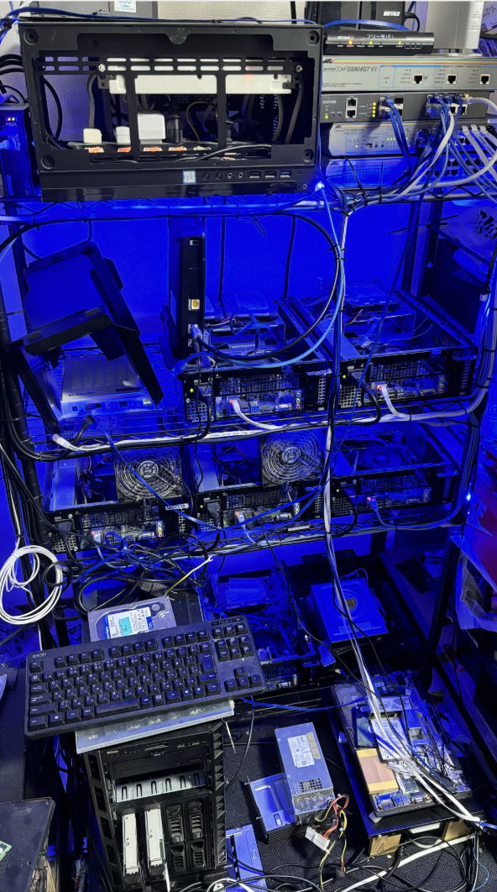
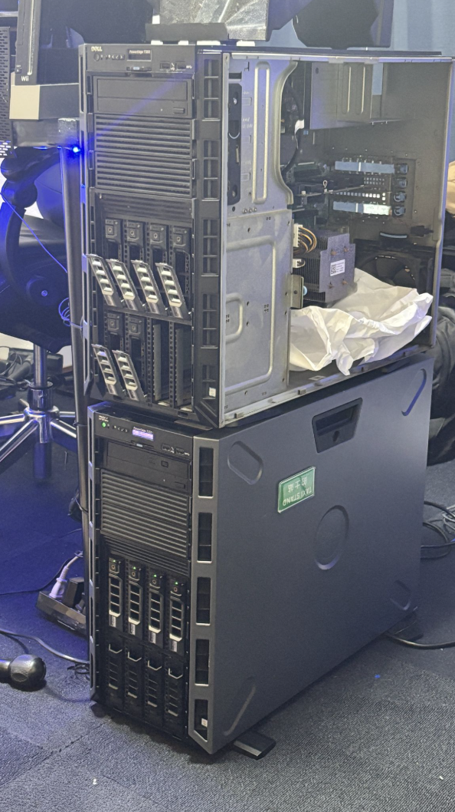

# 2025年度前期に取り組みたいこと

## 1. 自宅サーバーの監視システムの新規導入とDNSサーバーの構築

2025年度前期の第一の目標は、自宅サーバー環境の再整備です。現在は、これまで使用してきたサーバーから新しいハードウェアへの移行作業を進めており、それに伴って以下の取り組みを予定しています。

- **監視システムの導入**  
  ZabbixやPrometheusなどのツールを導入し、リソース監視・稼働状況の可視化を実現します。

- **DNSサーバーの構築**  
  BINDやdnsmasq等を用いてローカルDNSサーバーを構築し、ネットワーク内の名前解決を高速化・安定化させます。

- **旧サーバーの再活用**  
  使用を終えた旧サーバーは解体のうえ、監視ツールの検証環境やバックアップ用途として再活用します。

- **RAID崩壊トラブルの経験を活かす**  
  過去にRAID構成の崩壊を経験したことから、ストレージの冗長性確保や障害時の対処法についての知識を深めることも目的とします。

## 2. 自作WEBアプリのサービス化

これまで個人開発してきたWEBアプリを、実際のサービスとして展開することが第二の目標です。

- **本番環境への移行**  
  DockerやKubernetesを活用し、開発環境から商用運用可能な構成への移行を図ります。

- **ドメインとSSL対応**  
  独自ドメインを取得し、Let's Encrypt等を活用してHTTPS対応を進めます。

- **運用設計とCI/CD整備**  
  デプロイの自動化やログ管理・監視体制を整備し、継続的なサービス運用を可能にします。

- **ユーザーフィードバックの導入**  
  利用者の声を反映できるよう、フィードバックフォームやコメント機能を実装し、UX向上に繋げていきます。
